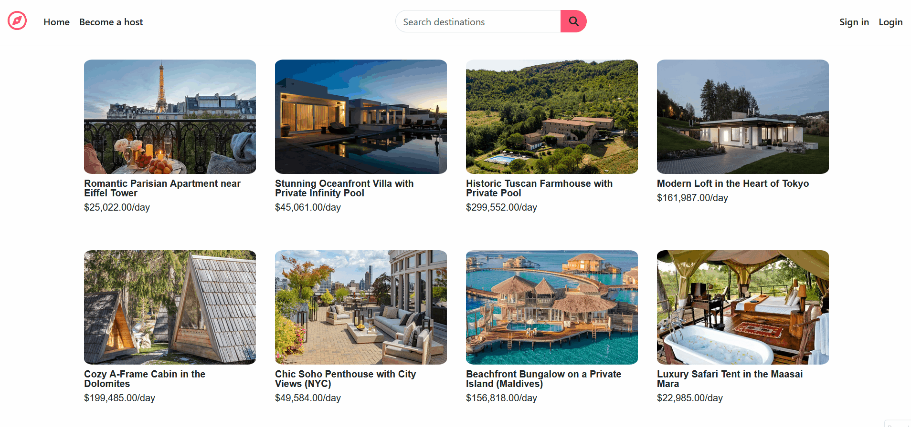

# Vagabond

**Vagabond** is a community-driven accommodation marketplace.It allows users to monetize their properties (hotels, houses, distinct stays) by hosting travelers, while enabling guests to discover and book unique accommodations around the world.

 

## Key Features

* **User Authentication:** Secure Login and Signup functionality using Passport.js.
* **CRUD Functionality:** Users can Create, Read, Update, and Delete their own property listings.
* **Smart Search:** Search bar functionality allows users to    filter properties by location or title instantly.
* **Review System:** Guests can leave star ratings and comments on properties they have visited.
* **Image Uploads:** Seamless image uploading for property listings.
* **Map Integration:** Interactive maps using **Mapbox** to show the exact location of properties.
* **Direct Booking Inquiries:** "Contact Owner" feature allows users to send direct booking emails to hosts via their default mail client.
* **User Profiles:** Dedicated user dashboards to manage user listings and reviews.


## Tech Stack

**Frontend:** HTML5, CSS3, Bootstrap 5 , EJS

**Backend:** Node.js, Express.js

**Database:** MongoDB, Mongoose

**Tools & APIs:**
* Mapbox GL JS (Maps)
* Cloudinary (Image Storage)
* Joi (Server-side validation)
* Passport.js (Authentication & Authorization)

## Installation & Setup

Follow these steps to run the project locally on your machine.

### Prerequisites
* Node.js installed
* MongoDB installed and running locally (or a MongoDB Atlas URI)

### Installation

1.  **Clone the repository**
    

2.  **Install dependencies**
    ```bash
    npm install
    ```

3.  **Set up Environment Variables**
    Create a `.env` file in the root directory and add the following:
    ```env
    PORT_NUMBER=8080
    CLOUD_NAME=your_cloudinary_name
    CLOUD_API=your_cloudinary_api_key
    CLOUD_SECRET=your_cloudinary_api_secret
    MAP_TOKEN=your_mapbox_token
    ATLASDB_URL=your_mongodb_connection_string
    SECRETCODE=your_session_secret
    ```

4.  **Run the application**
    ```bash
    node app.js
    # OR if you have nodemon installed
    npm run dev
    ```

5.  **Access the app**
    Open your browser and navigate to `http://localhost:8080`.
